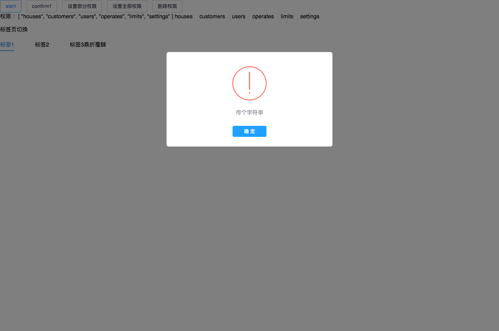
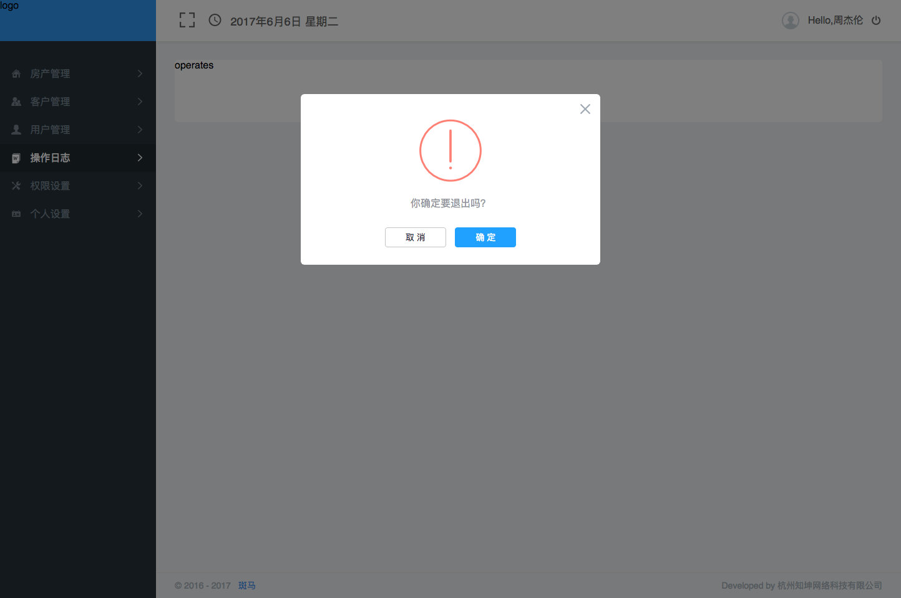

# 基于饿了么的vue后台管理系统模板

> A starter kit for Element UI generated by vue-cli

*If you are familiar with [cooking](https://github.com/elemefe/cooking), [here](https://github.com/ElementUI/element-cooking-starter) is a starter generated with it*

## Environment

`Node >= 6`
## 基于饿了么的模板配置做了进一步优化

## Start

 - Clone or download this repository
 - Enter your local directory, and install dependencies:

``` bash
npm install
```

## theme定制
``` bash
定义主题变量名  node_modules/.bin/et    //当前目录安装的  若全局安装过就跳过这步

et -i [可以自定义变量文件]
=》  生成一个element-variables.css文件，可直接在该文件内编辑主题配色
```

## vuex+vue-router+scss
- 业务逻辑函数封装在logicFn.js文件里  这个库挂载到VUE的原型链上
- components文件夹用于存放 公用组件  ， globals用于放置全局组件（alert,confirm）,views用于放置视图路由，css放所有的css文件，img放置项目图标
- main.js文件里导入iconfont作为项目按钮小图标  支持变色等操作
- 对vue-router 配置在route文件夹
- 通过用户登陆后 缓存用户信息  涉及到权限路由的配置  具体看vuex文件和test.vue文件

## css 配置
全局样式配置在base.scss文件  包含项目各种颜色 清浮动等常见设置
css入口文件 app.scss文件
图标文件在icon.css文件  强烈推荐阿里iconfont做项目按钮图片
在main.js里导入 app.scss
***
## 全局配置弹窗alert 和 confirm  （globals）

``` bash
# 利用vuex触发
this.$store.dispatch('ShowAlert','传个字符串')//显示出来  默认3000ms后自动消失，点击确定就清掉定时器消失
```


``` bash
# 具体调用confirm请看test.vue
```

## Develop

``` bash
# serve with hot reload at localhost:8010
npm run dev
```

## Build

``` bash
# build for production with minification
npm run build
```
